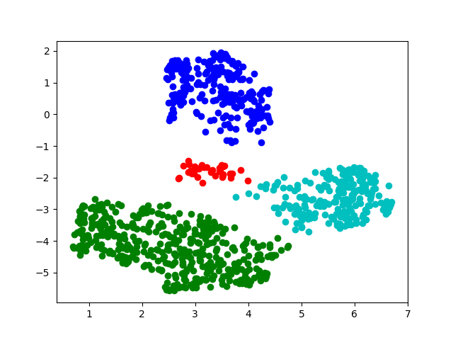
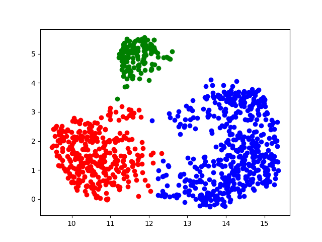
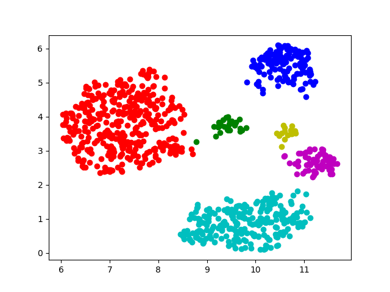
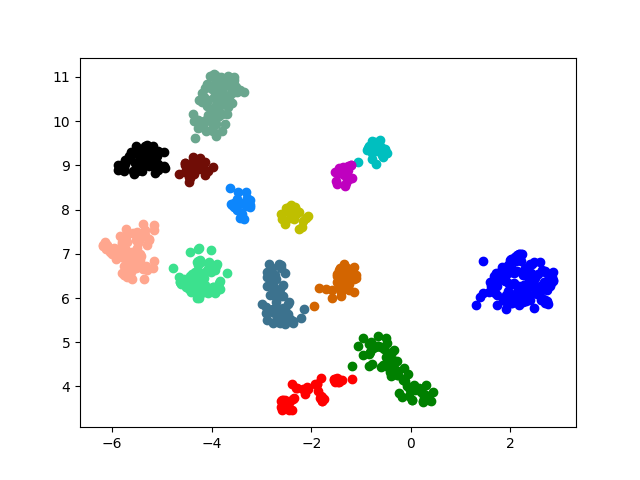
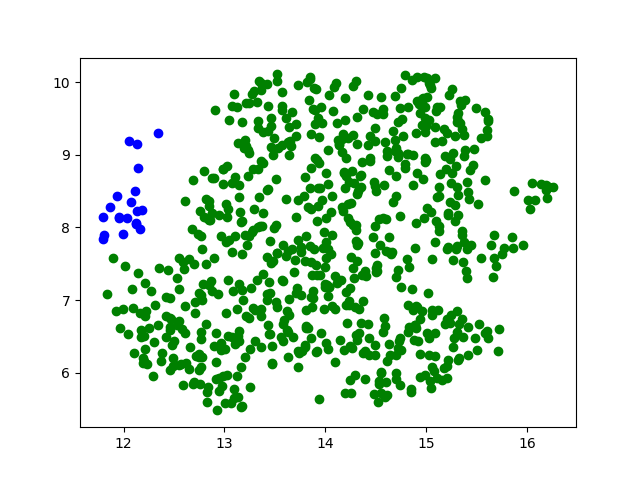
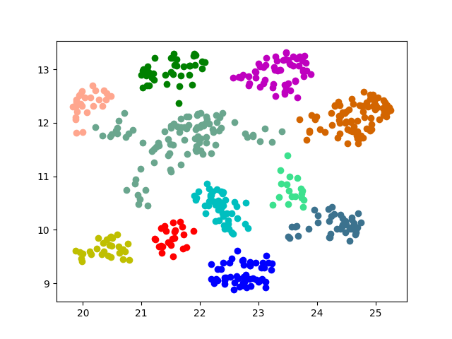
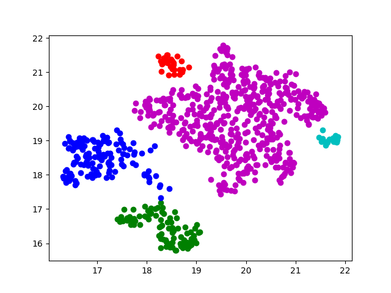
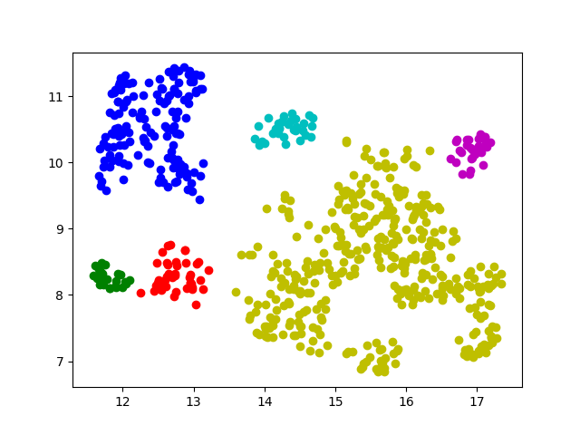

# Attack-Prone Feature Experiment
For each dataset, I randomly trained on 1000 sentences in the train set and randomly tested on 100 sentences in the test set. Then I randomly selected 100 sentences in the test set to attack the model with the PWWS attacker.
## Datasets
### ag_news
Average length: 45.897

### amazon_review_full
Average length: 100.649

### amazon_review_polarity
Average length: 101.834

### dbpedia
Average length: 66.228

### imdb
Average length: 321.64

### yahoo_answers
Average length: 56.644

### yelp_review_full
Average length: 190.98

### yelp_review_polarity
Average length: 188.554

# Results Overview

## Attack Success Rate
| MODEL\DATASET | ag_news | amazon_review_full | amazon_review_polarity | dbpedia | sogou_news | yahoo_answers | yelp_review_full | yelp_review_polarity |
|---------------|---------|--------------------|------------------------|---------|------------|---------------|------------------|----------------------|
| Character CNN | 0.63    | 0.86               | 0.5                    | 0.93    | X          | 0.72          | 0.71             | 0.38                 |
| Word CNN      | 0.67    | 0.8                | 0.43                   | 0.67    | X          | 0.81          | X                | 0.7                  |
| Bert-base     | 0.82    | 0.88               | 0.12                   | 0       | X          | 0.46          | 0.43             | 0.37                 |
| Roberta-base  | 0.03    | 0.01               | 0                      | 0.02    | 0          | 0.31          | 0.31             | 0.22                 |
| BiLSTM        | 0.87    | 0.62               | 0.57                   | 0.81    | 0.13       | 0.91          | X                | X                    |
| LSTM          | 0.65    | 0.75               | 0.7                    | 0.84    | 0.2        | 0.68          | X                | X                    |
| RNN           | 0.73    | 0.77               | 0.68                   | 0.79    | 0.44       | 0.89          | X                | X                    |
| BiRNN         | 0.86    | 0.83               | 0.72                   | 0.83    | 0.28       | 0.87          | X                | X                    |

# Character CNN
<!-- ## Traning Configuration
|       Batch Size       |        32        |
|:----------------------:|:----------------:|
| Number of tran samples | 1000             |
| Number of test samples |        100       |
|         Epoches        |        100       |
|      Learning rate     |       5e-4       |
| Sentence Length        | 1024 (character) | -->
## Summarizing Results
| **METRICS\DATASET**                | **ag_news** | **amazon_review_full** | **amazon_review_polarity** | **dbpedia** | **sogou_news** | **yahoo_answers** | **yelp_review_full** | **yelp_review_polarity** |
|:----------------------------------:|:-----------:|:----------------------:|:--------------------------:|:-----------:|:--------------:|:-----------------:|:--------------------:|:------------------------:|
| **Attack Success Rate**            | 0.63        | 0.86                   | 0.5                        | 0.93        | X              | 0.72              | 0.71                 | 0.38                     |
| **Avg. Running Time**              | 0.035337    | 0.046623               | 0.038393                   | 0.028483    | X              | 0.027664          | 0.073046             | 0.093736                 |
| **Avg. Victim Model Queries**      | 196.18      | 517.5                  | 489.46                     | 250.29      | X              | 272.14            | 1062.2               | 929.41                   |
| **Avg. Fluency**                   | 331.27      | 117.08                 | 116.68                     | 161.87      | X              | 2370.7            | 133.65               | 171.14                   |
| **Avg. Grammatical Errors**        | 10.73       | 19.849                 | 23.12                      | 15.398      | X              | 11.528            | 37.887               | 27.737                   |
| **Avg. Semantic Similarity**       | 0.89976     | 0.95675                | 0.95378                    | 0.9616      | X              | 0.89899           | 0.96549              | 0.92452                  |
| **Avg. Levenshtein Edit Distance** | 9.1111      | 12.163                 | 14.94                      | 17.065      | X              | 6.9306            | 20.873               | 16.684                   |
| **Avg. Word Modif. Rate**          | 0.24188     | 0.16075                | 0.20819                    | 0.31076     | X              | 0.18228           | 0.14237              | 0.14807                  |

## ag_news
|                  Summary|                   |
| ------ | ------ |
| Total Attacked Instances:       | 100      |
| Successful Instances:           | 63       |
| Attack Success Rate:            | 0.63     |
| Avg. Running Time:              | 0.035337 |
| Total Query Exceeded:           | 0        |
| Avg. Victim Model Queries:      | 196.18   |
| Avg. Fluency (ppl):             | 331.27   |
| Avg. Grammatical Errors:        | 10.73    |
| Avg. Semantic Similarity:       | 0.89976  |
| Avg. Levenshtein Edit Distance: | 9.1111   |
| Avg. Word Modif. Rate:          | 0.24188  |
## amazon_review_full
|                  Summary|                  |
| ------ | ------ |
| Total Attacked Instances:       | 100      |
| Successful Instances:           | 86       |
| Attack Success Rate:            | 0.86     |
| Avg. Running Time:              | 0.046623 |
| Total Query Exceeded:           | 0        |
| Avg. Victim Model Queries:      | 517.5    |
| Avg. Fluency (ppl):             | 117.08   |
| Avg. Grammatical Errors:        | 19.849   |
| Avg. Semantic Similarity:       | 0.95675  |
| Avg. Levenshtein Edit Distance: | 12.163   |
| Avg. Word Modif. Rate:          | 0.16075  |
## amazon_review_polarity
|                  Summary|                   |
| ------ | ------ |
| Total Attacked Instances:       | 100      |
| Successful Instances:           | 50       |
| Attack Success Rate:            | 0.5      |
| Avg. Running Time:              | 0.038393 |
| Total Query Exceeded:           | 0        |
| Avg. Victim Model Queries:      | 489.46   |
| Avg. Fluency (ppl):             | 116.68   |
| Avg. Grammatical Errors:        | 23.12    |
| Avg. Semantic Similarity:       | 0.95378  |
| Avg. Levenshtein Edit Distance: | 14.94    |
| Avg. Word Modif. Rate:          | 0.20819  |
## dbpedia
|                  Summary|                   |
| ------ | ------ |
| Total Attacked Instances:       | 100      |
| Successful Instances:           | 93       |
| Attack Success Rate:            | 0.93     |
| Avg. Running Time:              | 0.028483 |
| Total Query Exceeded:           | 0        |
| Avg. Victim Model Queries:      | 250.29   |
| Avg. Fluency (ppl):             | 161.87   |
| Avg. Grammatical Errors:        | 15.398   |
| Avg. Semantic Similarity:       | 0.9616   |
| Avg. Levenshtein Edit Distance: | 17.065   |
| Avg. Word Modif. Rate:          | 0.31076  |
## sogou_news
## yahoo_answers
|                  Summary|                   |
| ------ | ------ |
| Total Attacked Instances:       | 100      |
| Successful Instances:           | 72       |
| Attack Success Rate:            | 0.72     |
| Avg. Running Time:              | 0.027664 |
| Total Query Exceeded:           | 0        |
| Avg. Victim Model Queries:      | 272.14   |
| Avg. Fluency (ppl):             | 2370.7   |
| Avg. Grammatical Errors:        | 11.528   |
| Avg. Semantic Similarity:       | 0.89899  |
| Avg. Levenshtein Edit Distance: | 6.9306   |
| Avg. Word Modif. Rate:          | 0.18228  |
## yelp_review_full
|                  Summary|                   |
| ------ | ------ |
| Total Attacked Instances:       | 100      |
| Successful Instances:           | 71       |
| Attack Success Rate:            | 0.71     |
| Avg. Running Time:              | 0.073046 |
| Total Query Exceeded:           | 0        |
| Avg. Victim Model Queries:      | 1062.2   |
| Avg. Fluency (ppl):             | 133.65   |
| Avg. Grammatical Errors:        | 37.887   |
| Avg. Semantic Similarity:       | 0.96549  |
| Avg. Levenshtein Edit Distance: | 20.873   |
| Avg. Word Modif. Rate:          | 0.14237  |
## yelp_review_polarity
|                  Summary|                   |
| ------ | ------ |
| Total Attacked Instances:       | 100      |
| Successful Instances:           | 38       |
| Attack Success Rate:            | 0.38     |
| Avg. Running Time:              | 0.093736 |
| Total Query Exceeded:           | 0        |
| Avg. Victim Model Queries:      | 929.41   |
| Avg. Fluency (ppl):             | 171.14   |
| Avg. Grammatical Errors:        | 27.737   |
| Avg. Semantic Similarity:       | 0.92452  |
| Avg. Levenshtein Edit Distance: | 16.684   |
| Avg. Word Modif. Rate:          | 0.14807  |
# Word CNN
## Summarizing Results
| **METRICS\DATASET**                | **ag_news** | **amazon_review_full** | **amazon_review_polarity** | **dbpedia** | **sogou_news** | **yahoo_answers** | **yelp_review_full** | **yelp_review_polarity** |
|:----------------------------------:|:-----------:|:----------------------:|:--------------------------:|:-----------:|:--------------:|:-----------------:|:--------------------:|:------------------------:|
| **Attack Success Rate**            | 0.67        | 0.8                    | 0.43                       | 0.67        | X              | 0.72              | 0.81                 | 0.7                      |
| **Avg. Running Time**              | 0.01234     | 0.024652               | 0.025495                   | 0.013617    | X              | 0.027664          | 0.013024             | 0.064513                 |
| **Avg. Victim Model Queries**      | 187.12      | 512.63                 | 499.65                     | 241.65      | X              | 272.14            | 217.63               | 1074.8                   |
| **Avg. Fluency**                   | 340.4       | 115.04                 | 144.82                     | 174.33      | X              | 2370.7            | 822.04               | 94.452                   |
| **Avg. Grammatical Errors**        | 7.3582      | 19.325                 | 19.767                     | 16.478      | X              | 11.528            | 8.2222               | 32.614                   |
| **Avg. Semantic Similarity**       | 0.94288     | 0.95634                | 0.93881                    | 0.9458      | X              | 0.89899           | 0.86665              | 0.96492                  |
| **Avg. Levenshtein Edit Distance** | 7.9701      | 11.363                 | 12.535                     | 18.149      | X              | 6.9306            | 4.6173               | 17.2                     |
| **Avg. Word Modif. Rate**          | 0.244       | 0.14546                | 0.16122                    | 0.32841     | X              | 0.18228           | 0.17336              | 0.12796                  |

## ag_news
|                  Summary|                  |
| ------ | ------ |
| Total Attacked Instances:       | 100     |
| Successful Instances:           | 67      |
| Attack Success Rate:            | 0.67    |
| Avg. Running Time:              | 0.01234 |
| Total Query Exceeded:           | 0       |
| Avg. Victim Model Queries:      | 187.12  |
| Avg. Fluency (ppl):             | 340.4   |
| Avg. Grammatical Errors:        | 7.3582  |
| Avg. Semantic Similarity:       | 0.94288 |
| Avg. Levenshtein Edit Distance: | 7.9701  |
| Avg. Word Modif. Rate:          | 0.244   |
## amazon_review_full
|                  Summary|                   |
| ------ | ------ |
| Total Attacked Instances:       | 100      |
| Successful Instances:           | 80       |
| Attack Success Rate:            | 0.8      |
| Avg. Running Time:              | 0.024652 |
| Total Query Exceeded:           | 0        |
| Avg. Victim Model Queries:      | 512.63   |
| Avg. Fluency (ppl):             | 115.04   |
| Avg. Grammatical Errors:        | 19.325   |
| Avg. Semantic Similarity:       | 0.95634  |
| Avg. Levenshtein Edit Distance: | 11.363   |
| Avg. Word Modif. Rate:          | 0.14546  |
## amazon_review_polarity
|                  Summary|                   |
| ------ | ------ |
| Total Attacked Instances:       | 100      |
| Successful Instances:           | 43       |
| Attack Success Rate:            | 0.43     |
| Avg. Running Time:              | 0.025495 |
| Total Query Exceeded:           | 0        |
| Avg. Victim Model Queries:      | 499.65   |
| Avg. Fluency (ppl):             | 144.82   |
| Avg. Grammatical Errors:        | 19.767   |
| Avg. Semantic Similarity:       | 0.93881  |
| Avg. Levenshtein Edit Distance: | 12.535   |
| Avg. Word Modif. Rate:          | 0.16122  |
## dbpedia
|                  Summary|                   |
| ------ | ------ |
| Total Attacked Instances:       | 100      |
| Successful Instances:           | 67       |
| Attack Success Rate:            | 0.67     |
| Avg. Running Time:              | 0.013617 |
| Total Query Exceeded:           | 0        |
| Avg. Victim Model Queries:      | 241.65   |
| Avg. Fluency (ppl):             | 174.33   |
| Avg. Grammatical Errors:        | 16.478   |
| Avg. Semantic Similarity:       | 0.9458   |
| Avg. Levenshtein Edit Distance: | 18.149   |
| Avg. Word Modif. Rate:          | 0.32841  |
## sogou_news
## yahoo_answers
|                  Summary|                   |
| ------ | ------ |
| Total Attacked Instances:       | 100      |
| Successful Instances:           | 81       |
| Attack Success Rate:            | 0.81     |
| Avg. Running Time:              | 0.013024 |
| Total Query Exceeded:           | 0        |
| Avg. Victim Model Queries:      | 217.63   |
| Avg. Fluency (ppl):             | 822.04   |
| Avg. Grammatical Errors:        | 8.2222   |
| Avg. Semantic Similarity:       | 0.86665  |
| Avg. Levenshtein Edit Distance: | 4.6173   |
| Avg. Word Modif. Rate:          | 0.17336  |
## yelp_review_full
## yelp_review_polarity
|                  Summary|                  |
| ------ | ------ |
| Total Attacked Instances:       | 100      |
| Successful Instances:           | 70       |
| Attack Success Rate:            | 0.7      |
| Avg. Running Time:              | 0.064513 |
| Total Query Exceeded:           | 0        |
| Avg. Victim Model Queries:      | 1074.8   |
| Avg. Fluency (ppl):             | 94.452   |
| Avg. Grammatical Errors:        | 32.614   |
| Avg. Semantic Similarity:       | 0.96492  |
| Avg. Levenshtein Edit Distance: | 17.2     |
| Avg. Word Modif. Rate:          | 0.12796  |
# Bert-base
## Summarizing Results
| **METRICS\DATASET**                | **ag_news** | **amazon_review_full** | **amazon_review_polarity** | **dbpedia** | **sogou_news** | **yahoo_answers** | **yelp_review_full** | **yelp_review_polarity** |
|:----------------------------------:|:-----------:|:----------------------:|:--------------------------:|:-----------:|:--------------:|:-----------------:|:--------------------:|:------------------------:|
| **Attack Success Rate**            | 0.82        | 0.88                   | 0.12                       | 0           | X              | 0.46              | 0.43                 | 0.37                     |
| **Avg. Running Time**              | 0.0612      | 0.088293               | 0.31382                    | 0.23207     | X              | 0.09895           | 0.39631              | 0.59489                  |
| **Avg. Victim Model Queries**      | 183.42      | 523.1                  | 581.08                     | 237.29      | X              | 244.12            | 943.95               | 1123.8                   |
| **Avg. Fluency**                   | 492.2       | 178.6                  | 121.99                     | X           | X              | 1095.9            | 274.61               | 265.19                   |
| **Avg. Grammatical Errors**        | 9.0976      | 20.114                 | 23.583                     | X           | X              | 10.217            | 29.326               | 16.73                    |
| **Avg. Semantic Similarity**       | 0.89378     | 0.90382                | 0.92965                    | X           | X              | 0.79672           | 0.8389               | 0.88568                  |
| **Avg. Levenshtein Edit Distance** | 10.293      | 14.739                 | 18.917                     | X           | X              | 6.9783            | 28.907               | 15.622                   |
| **Avg. Word Modif. Rate**          | 0.30092     | 0.26033                | 0.20811                    | X           | X              | 0.25843           | 0.30585              | 0.21581                  |
## ag_news
|                  Summary|                  |
| ------ | ------ |
| Total Attacked Instances:       | 100     |
| Successful Instances:           | 82      |
| Attack Success Rate:            | 0.82    |
| Avg. Running Time:              | 0.0612  |
| Total Query Exceeded:           | 0       |
| Avg. Victim Model Queries:      | 183.42  |
| Avg. Fluency (ppl):             | 492.2   |
| Avg. Grammatical Errors:        | 9.0976  |
| Avg. Semantic Similarity:       | 0.89378 |
| Avg. Levenshtein Edit Distance: | 10.293  |
| Avg. Word Modif. Rate:          | 0.30092 |
## amazon_review_full
|                  Summary|                   |
| ------ | ------ |
| Total Attacked Instances:       | 100      |
| Successful Instances:           | 88       |
| Attack Success Rate:            | 0.88     |
| Avg. Running Time:              | 0.088293 |
| Total Query Exceeded:           | 0        |
| Avg. Victim Model Queries:      | 523.1    |
| Avg. Fluency (ppl):             | 178.6    |
| Avg. Grammatical Errors:        | 20.114   |
| Avg. Semantic Similarity:       | 0.90382  |
| Avg. Levenshtein Edit Distance: | 14.739   |
| Avg. Word Modif. Rate:          | 0.26033  |
## amazon_review_polarity
|                  Summary|                  |
| ------ | ------ |
| Total Attacked Instances:       | 100     |
| Successful Instances:           | 12      |
| Attack Success Rate:            | 0.12    |
| Avg. Running Time:              | 0.31382 |
| Total Query Exceeded:           | 0       |
| Avg. Victim Model Queries:      | 581.08  |
| Avg. Fluency (ppl):             | 121.99  |
| Avg. Grammatical Errors:        | 23.583  |
| Avg. Semantic Similarity:       | 0.92965 |
| Avg. Levenshtein Edit Distance: | 18.917  |
| Avg. Word Modif. Rate:          | 0.20811 |
## dbpedia
|               Summary|                |
| ------ | ------ |
| Total Attacked Instances:  | 100     |
| Successful Instances:      | 0       |
| Attack Success Rate:       | 0       |
| Avg. Running Time:         | 0.23207 |
| Total Query Exceeded:      | 0       |
| Avg. Victim Model Queries: | 237.29  |
## sogou_news
## yahoo_answers
|                  Summary|                  |
| ------ | ------ |
| Total Attacked Instances:       | 100     |
| Successful Instances:           | 46      |
| Attack Success Rate:            | 0.46    |
| Avg. Running Time:              | 0.09895 |
| Total Query Exceeded:           | 0       |
| Avg. Victim Model Queries:      | 244.12  |
| Avg. Fluency (ppl):             | 1095.9  |
| Avg. Grammatical Errors:        | 10.217  |
| Avg. Semantic Similarity:       | 0.79672 |
| Avg. Levenshtein Edit Distance: | 6.9783  |
| Avg. Word Modif. Rate:          | 0.25843 |
## yelp_review_full
|                  Summary|                  |
| ------ | ------ |
| Total Attacked Instances:       | 100     |
| Successful Instances:           | 43      |
| Attack Success Rate:            | 0.43    |
| Avg. Running Time:              | 0.39631 |
| Total Query Exceeded:           | 0       |
| Avg. Victim Model Queries:      | 943.95  |
| Avg. Fluency (ppl):             | 274.61  |
| Avg. Grammatical Errors:        | 29.326  |
| Avg. Semantic Similarity:       | 0.8389  |
| Avg. Levenshtein Edit Distance: | 28.907  |
| Avg. Word Modif. Rate:          | 0.30585 |
## yelp_review_polarity
|                  Summary|                  |
| ------ | ------ |
| Total Attacked Instances:       | 100     |
| Successful Instances:           | 37      |
| Attack Success Rate:            | 0.37    |
| Avg. Running Time:              | 0.59489 |
| Total Query Exceeded:           | 0       |
| Avg. Victim Model Queries:      | 1123.8  |
| Avg. Fluency (ppl):             | 265.19  |
| Avg. Grammatical Errors:        | 16.73   |
| Avg. Semantic Similarity:       | 0.88568 |
| Avg. Levenshtein Edit Distance: | 15.622  |
| Avg. Word Modif. Rate:          | 0.21581 |
# Roberta-base
## Summarizing Results
| **METRICS\DATASET**                | **ag_news** | **amazon_review_full** | **amazon_review_polarity** | **dbpedia** | **sogou_news** | **yahoo_answers** | **yelp_review_full** | **yelp_review_polarity** |
|:----------------------------------:|:-----------:|:----------------------:|:--------------------------:|:-----------:|:--------------:|:-----------------:|:--------------------:|:------------------------:|
| **Attack Success Rate**            | 0.03        | 0.01                   | 0                          | 0.02        | 0              | 0.31              | 0.31                 | 0.22                     |
| **Avg. Running Time**              | 0.17399     | 0.30209                | 0.33149                    | 0.20821     | 2.8389         | 0.10891           | 0.38577              | 0.4549                   |
| **Avg. Victim Model Queries**      | 214.7       | 558.37                 | 624.26                     | 248.63      | 1045.1         | 325.3             | 1138.2               | 984.76                   |
| **Avg. Fluency**                   | 481.11      | 86.099                 | X                          | 190.8       | X              | 220.26            | 126.79               | 215.4                    |
| **Avg. Grammatical Errors**        | 7.3333      | 27                     | X                          | 5.5         | X              | 25.226            | 62.452               | 32.591                   |
| **Avg. Semantic Similarity**       | 0.89451     | 0.93297                | X                          | 0.92398     | X              | 0.82606           | 0.90426              | 0.8901                   |
| **Avg. Levenshtein Edit Distance** | 8.3333      | 27                     | X                          | 3.5         | X              | 20.581            | 51.742               | 27.773                   |
| **Avg. Word Modif. Rate**          | 0.54254     | 0.75325                | X                          | 0.20238     | X              | 0.27474           | 0.4104               | 0.52619                  |

## ag_news
|                  Summary|                  |
| ------ | ------ |
| Total Attacked Instances:       | 100     |
| Successful Instances:           | 3       |
| Attack Success Rate:            | 0.03    |
| Avg. Running Time:              | 0.17399 |
| Total Query Exceeded:           | 0       |
| Avg. Victim Model Queries:      | 214.7   |
| Avg. Fluency (ppl):             | 481.11  |
| Avg. Grammatical Errors:        | 7.3333  |
| Avg. Semantic Similarity:       | 0.89451 |
| Avg. Levenshtein Edit Distance: | 8.3333  |
| Avg. Word Modif. Rate:          | 0.54254 |
## amazon_review_full
|                  Summary|                  |
| ------ | ------ |
| Total Attacked Instances:       | 100     |
| Successful Instances:           | 1       |
| Attack Success Rate:            | 0.01    |
| Avg. Running Time:              | 0.30209 |
| Total Query Exceeded:           | 0       |
| Avg. Victim Model Queries:      | 558.37  |
| Avg. Fluency (ppl):             | 86.099  |
| Avg. Grammatical Errors:        | 27      |
| Avg. Semantic Similarity:       | 0.93297 |
| Avg. Levenshtein Edit Distance: | 27      |
| Avg. Word Modif. Rate:          | 0.75325 |
## amazon_review_polarity
|               Summary|                |
| ------ | ------ |
| Total Attacked Instances:  | 100     |
| Successful Instances:      | 0       |
| Attack Success Rate:       | 0       |
| Avg. Running Time:         | 0.33149 |
| Total Query Exceeded:      | 0       |
| Avg. Victim Model Queries: | 624.26  |
## dbpedia
|                  Summary|                  |
| ------ | ------ |
| Total Attacked Instances:       | 100     |
| Successful Instances:           | 2       |
| Attack Success Rate:            | 0.02    |
| Avg. Running Time:              | 0.20821 |
| Total Query Exceeded:           | 0       |
| Avg. Victim Model Queries:      | 248.63  |
| Avg. Fluency (ppl):             | 190.8   |
| Avg. Grammatical Errors:        | 5.5     |
| Avg. Semantic Similarity:       | 0.92398 |
| Avg. Levenshtein Edit Distance: | 3.5     |
| Avg. Word Modif. Rate:          | 0.20238 |
## sogou_news
|               Summary|               |
| ------ | ------ |
| Total Attacked Instances:  | 100    |
| Successful Instances:      | 0      |
| Attack Success Rate:       | 0      |
| Avg. Running Time:         | 2.8389 |
| Total Query Exceeded:      | 0      |
| Avg. Victim Model Queries: | 1045.1 |
## yahoo_answers
|                  Summary|                  |
| ------ | ------ |
| Total Attacked Instances:       | 100     |
| Successful Instances:           | 31      |
| Attack Success Rate:            | 0.31    |
| Avg. Running Time:              | 0.10891 |
| Total Query Exceeded:           | 0       |
| Avg. Victim Model Queries:      | 325.3   |
| Avg. Fluency (ppl):             | 220.26  |
| Avg. Grammatical Errors:        | 25.226  |
| Avg. Semantic Similarity:       | 0.82606 |
| Avg. Levenshtein Edit Distance: | 20.581  |
| Avg. Word Modif. Rate:          | 0.27474 |
## yelp_review_full
|                  Summary|                  |
| ------ | ------ |
| Total Attacked Instances:       | 100     |
| Successful Instances:           | 31      |
| Attack Success Rate:            | 0.31    |
| Avg. Running Time:              | 0.38577 |
| Total Query Exceeded:           | 0       |
| Avg. Victim Model Queries:      | 1138.2  |
| Avg. Fluency (ppl):             | 126.79  |
| Avg. Grammatical Errors:        | 62.452  |
| Avg. Semantic Similarity:       | 0.90426 |
| Avg. Levenshtein Edit Distance: | 51.742  |
| Avg. Word Modif. Rate:          | 0.4104  |
## yelp_review_polarity
|                  Summary|                  |
| ------ | ------ |
| Total Attacked Instances:       | 100     |
| Successful Instances:           | 22      |
| Attack Success Rate:            | 0.22    |
| Avg. Running Time:              | 0.4549  |
| Total Query Exceeded:           | 0       |
| Avg. Victim Model Queries:      | 984.76  |
| Avg. Fluency (ppl):             | 215.4   |
| Avg. Grammatical Errors:        | 32.591  |
| Avg. Semantic Similarity:       | 0.8901  |
| Avg. Levenshtein Edit Distance: | 27.773  |
| Avg. Word Modif. Rate:          | 0.52619 |
# BiLSTM
## Traning Configuration
|       Batch Size       |  32  |
|:----------------------:|:----:|
| Number of tran samples | 1000 |
| Number of test samples |  100 |
|         Epoches        |  150 |
|      Learning rate     | 5e-4 |
| Sentence Length        | 10   |
## Summarizing Results
| **METRICS\DATASET**                | **ag_news** | **amazon_review_full** | **amazon_review_polarity** | **dbpedia** | **sogou_news** | **yahoo_answers** | **yelp_review_full** | **yelp_review_polarity** |
|:----------------------------------:|:-----------:|:----------------------:|:--------------------------:|:-----------:|:--------------:|:-----------------:|:--------------------:|:------------------------:|
| **Attack Success Rate**            | 0.87        | 0.62                   | 0.57                       | 0.81        | 0.13           | 0.91              | X                    | X                        |
| **Avg. Running Time**              | 0.0072137   | 0.0085613              | 0.0074409                  | 0.0076351   | 0.014523       | 0.010651          | X                    | X                        |
| **Avg. Victim Model Queries**      | 48.54       | 37.04                  | 36.99                      | 16.5        | 29             | 77.03             | X                    | X                        |
| **Avg. Fluency**                   | 16284       | 5983.8                 | 8623.7                     | 7071.9      | 314.49         | 2241.4            | X                    | X                        |
| **Avg. Grammatical Errors**        | 2.2529      | 1.371                  | 1.3684                     | 2.0741      | 6.8462         | 2.7143            | X                    | X                        |
| **Avg. Semantic Similarity**       | 0.83014     | 0.71345                | 0.69062                    | 0.77779     | 0.95363        | 0.84422           | X                    | X                        |
| **Avg. Levenshtein Edit Distance** | 4.1724      | 2.5968                 | 2.7368                     | 2.7407      | 0.46154        | 3.0879            | X                    | X                        |
| **Avg. Word Modif. Rate**          | 0.60395     | 0.68857                | 0.62544                    | 0.834       | 0.054654       | 0.2868            | X                    | X                        |

## ag_news
|                  Summary|                   |
| ------ | ------ |
| Total Attacked Instances:       | 100      |
| Successful Instances:           | 79       |
| Attack Success Rate:            | 0.79     |
| Avg. Running Time:              | 0.010232 |
| Total Query Exceeded:           | 0        |
| Avg. Victim Model Queries:      | 54.06    |
| Avg. Fluency (ppl):             | 17736    |
| Avg. Grammatical Errors:        | 2.9241   |
| Avg. Semantic Similarity:       | 0.82964  |
| Avg. Levenshtein Edit Distance: | 4.7848   |
| Avg. Word Modif. Rate:          | 0.58685  |
## amazon_review_full
|                   Summary|                   |
| ------ | ------ |
| Total Attacked Instances:       | 100       |
| Successful Instances:           | 73        |
| Attack Success Rate:            | 0.73      |
| Avg. Running Time:              | 0.0058532 |
| Total Query Exceeded:           | 0         |
| Avg. Victim Model Queries:      | 38.57     |
| Avg. Fluency (ppl):             | 15906     |
| Avg. Grammatical Errors:        | 1.5753    |
| Avg. Semantic Similarity:       | 0.7291    |
| Avg. Levenshtein Edit Distance: | 2.5205    |
| Avg. Word Modif. Rate:          | 0.64812   |
## amazon_review_polarity
|                   Summary|                   |
| ------ | ------ |
| Total Attacked Instances:       | 100       |
| Successful Instances:           | 74        |
| Attack Success Rate:            | 0.74      |
| Avg. Running Time:              | 0.0083578 |
| Total Query Exceeded:           | 0         |
| Avg. Victim Model Queries:      | 39.37     |
| Avg. Fluency (ppl):             | 9704.9    |
| Avg. Grammatical Errors:        | 1.6216    |
| Avg. Semantic Similarity:       | 0.69535   |
| Avg. Levenshtein Edit Distance: | 2.6892    |
| Avg. Word Modif. Rate:          | 0.68286   |
## dbpedia
|                   Summary|                   |
| ------ | ------ |
| Total Attacked Instances:       | 100       |
| Successful Instances:           | 79        |
| Attack Success Rate:            | 0.79      |
| Avg. Running Time:              | 0.0050592 |
| Total Query Exceeded:           | 0         |
| Avg. Victim Model Queries:      | 15.66     |
| Avg. Fluency (ppl):             | 16167     |
| Avg. Grammatical Errors:        | 2.2532    |
| Avg. Semantic Similarity:       | 0.7547    |
| Avg. Levenshtein Edit Distance: | 2.6962    |
| Avg. Word Modif. Rate:          | 0.82727   |
## sogou_news
|                  Summary|                   |
| ------ | ------ |
| Total Attacked Instances:       | 100      |
| Successful Instances:           | 16       |
| Attack Success Rate:            | 0.16     |
| Avg. Running Time:              | 0.014101 |
| Total Query Exceeded:           | 0        |
| Avg. Victim Model Queries:      | 29.48    |
| Avg. Fluency (ppl):             | 430.02   |
| Avg. Grammatical Errors:        | 6.8125   |
| Avg. Semantic Similarity:       | 0.88678  |
| Avg. Levenshtein Edit Distance: | 0.5      |
| Avg. Word Modif. Rate:          | 0.13472  |
## yahoo_answers
|                   Summary|                   |
| ------ | ------ |
| Total Attacked Instances:       | 100       |
| Successful Instances:           | 78        |
| Attack Success Rate:            | 0.78      |
| Avg. Running Time:              | 0.0089328 |
| Total Query Exceeded:           | 0         |
| Avg. Victim Model Queries:      | 69.32     |
| Avg. Fluency (ppl):             | 2491.8    |
| Avg. Grammatical Errors:        | 2.4615    |
| Avg. Semantic Similarity:       | 0.81811   |
| Avg. Levenshtein Edit Distance: | 2.7179    |
| Avg. Word Modif. Rate:          | 0.32851   |
# LSTM
## Summarizing Results
| **METRICS\DATASET**                | **ag_news** | **amazon_review_full** | **amazon_review_polarity** | **dbpedia** | **sogou_news** | **yahoo_answers** | **yelp_review_full** | **yelp_review_polarity** |
|:----------------------------------:|:-----------:|:----------------------:|:--------------------------:|:-----------:|:--------------:|:-----------------:|:--------------------:|:------------------------:|
| **Attack Success Rate**            | 0.65        | 0.75                   | 0.7                        | 0.84        | 0.2            | 0.68              | X                    | X                        |
| **Avg. Running Time**              | 0.0086237   | 0.0085722              | 0.010094                   | 0.006229    | 0.012125       | 0.0079263         | X                    | X                        |
| **Avg. Victim Model Queries**      | 51.75       | 37.04                  | 36.79                      | 16.59       | 28.66          | 73.13             | X                    | X                        |
| **Avg. Fluency**                   | 4305.2      | 26716                  | 7755.1                     | 20182       | 164.88         | 2978.7            | X                    | X                        |
| **Avg. Grammatical Errors**        | 2.6615      | 1.72                   | 1.4857                     | 1.9048      | 9              | 3.0588            | X                    | X                        |
| **Avg. Semantic Similarity**       | 0.8055      | 0.67169                | 0.68932                    | 0.76734     | 0.9367         | 0.82857           | X                    | X                        |
| **Avg. Levenshtein Edit Distance** | 5.1692      | 2.6533                 | 2.5429                     | 2.7381      | 0.4            | 3.2794            | X                    | X                        |
| **Avg. Word Modif. Rate**          | 0.66454     | 0.57327                | 0.66905                    | 0.84702     | 0.044097       | 0.30678           | X                    | X                        |
## ag_news
|                   Summary|                   |
| ------ | ------ |
| Total Attacked Instances:       | 100       |
| Successful Instances:           | 84        |
| Attack Success Rate:            | 0.84      |
| Avg. Running Time:              | 0.0093035 |
| Total Query Exceeded:           | 0         |
| Avg. Victim Model Queries:      | 53.84     |
| Avg. Fluency (ppl):             | 26987     |
| Avg. Grammatical Errors:        | 2.8214    |
| Avg. Semantic Similarity:       | 0.83724   |
| Avg. Levenshtein Edit Distance: | 4.8333    |
| Avg. Word Modif. Rate:          | 0.6009    |
## amazon_review_full
|                   Summary|                   |
| ------ | ------ |
| Total Attacked Instances:       | 100       |
| Successful Instances:           | 78        |
| Attack Success Rate:            | 0.78      |
| Avg. Running Time:              | 0.0068884 |
| Total Query Exceeded:           | 0         |
| Avg. Victim Model Queries:      | 38.46     |
| Avg. Fluency (ppl):             | 23093     |
| Avg. Grammatical Errors:        | 1.6667    |
| Avg. Semantic Similarity:       | 0.7452    |
| Avg. Levenshtein Edit Distance: | 2.2564    |
| Avg. Word Modif. Rate:          | 0.54297   |
## amazon_review_polarity
|                   Summary|                   |
| ------ | ------ |
| Total Attacked Instances:       | 100       |
| Successful Instances:           | 68        |
| Attack Success Rate:            | 0.68      |
| Avg. Running Time:              | 0.0073055 |
| Total Query Exceeded:           | 0         |
| Avg. Victim Model Queries:      | 33.31     |
| Avg. Fluency (ppl):             | 5952.4    |
| Avg. Grammatical Errors:        | 1.5294    |
| Avg. Semantic Similarity:       | 0.72107   |
| Avg. Levenshtein Edit Distance: | 2.5       |
| Avg. Word Modif. Rate:          | 0.66541   |
## dbpedia
|                   Summary|                   |
| ------ | ------ |
| Total Attacked Instances:       | 100       |
| Successful Instances:           | 77        |
| Attack Success Rate:            | 0.77      |
| Avg. Running Time:              | 0.0066363 |
| Total Query Exceeded:           | 0         |
| Avg. Victim Model Queries:      | 15.62     |
| Avg. Fluency (ppl):             | 14218     |
| Avg. Grammatical Errors:        | 2.2468    |
| Avg. Semantic Similarity:       | 0.78516   |
| Avg. Levenshtein Edit Distance: | 2.8052    |
| Avg. Word Modif. Rate:          | 0.85711   |
## sogou_news
|                   Summary|                   |
| ------ | ------ |
| Total Attacked Instances:       | 100       |
| Successful Instances:           | 27        |
| Attack Success Rate:            | 0.27      |
| Avg. Running Time:              | 0.0061623 |
| Total Query Exceeded:           | 0         |
| Avg. Victim Model Queries:      | 26.63     |
| Avg. Fluency (ppl):             | 307.21    |
| Avg. Grammatical Errors:        | 7.9259    |
| Avg. Semantic Similarity:       | 0.8928    |
| Avg. Levenshtein Edit Distance: | 0.40741   |
| Avg. Word Modif. Rate:          | 0.080505  |
## yahoo_answers
|                  Summary|                   |
| ------ | ------ |
| Total Attacked Instances:       | 100      |
| Successful Instances:           | 79       |
| Attack Success Rate:            | 0.79     |
| Avg. Running Time:              | 0.005626 |
| Total Query Exceeded:           | 0        |
| Avg. Victim Model Queries:      | 69.57    |
| Avg. Fluency (ppl):             | 3841.2   |
| Avg. Grammatical Errors:        | 2.8608   |
| Avg. Semantic Similarity:       | 0.81201  |
| Avg. Levenshtein Edit Distance: | 3.3418   |
| Avg. Word Modif. Rate:          | 0.34942  |
# RNN
| **METRICS\DATASET**                | **ag_news** | **amazon_review_full** | **amazon_review_polarity** | **dbpedia** | **sogou_news** | **yahoo_answers** | **yelp_review_full** | **yelp_review_polarity** |
|:----------------------------------:|:-----------:|:----------------------:|:--------------------------:|:-----------:|:--------------:|:-----------------:|:--------------------:|:------------------------:|
| **Attack Success Rate**            | 0.73        | 0.77                   | 0.68                       | 0.79        | 0.44           | 0.89              | X                    | X                        |
| **Avg. Running Time**              | 0.0061613   | 0.0048711              | 0.0064955                  | 0.005091    | 0.0059475      | 0.0086533         | X                    | X                        |
| **Avg. Victim Model Queries**      | 48.94       | 40.3                   | 35.06                      | 12.76       | 23.27          | 75.02             | X                    | X                        |
| **Avg. Fluency**                   | 12848       | 13399                  | nan                        | 13204       | 156.9          | 2533.3            | X                    | X                        |
| **Avg. Grammatical Errors**        | 2.3836      | 1.6104                 | 1.4853                     | 2.2658      | 9.5            | 2.7191            | X                    | X                        |
| **Avg. Semantic Similarity**       | 0.81213     | 0.7122                 | 0.71555                    | 0.83975     | 0.98492        | 0.8352            | X                    | X                        |
| **Avg. Levenshtein Edit Distance** | 4.8767      | 2.5974                 | 2.6618                     | 2.5063      | 0.22727        | 2.7079            | X                    | X                        |
| **Avg. Word Modif. Rate**          | 0.65107     | 0.5635                 | 0.6161                     | 0.82188     | 0.026962       | 0.29397           | X                    | X                        |
## ag_news
|                   Summary|                   |
| ------ | ------ |
| Total Attacked Instances:       | 100       |
| Successful Instances:           | 88        |
| Attack Success Rate:            | 0.88      |
| Avg. Running Time:              | 0.0061675 |
| Total Query Exceeded:           | 0         |
| Avg. Victim Model Queries:      | 53.83     |
| Avg. Fluency (ppl):             | 5482.2    |
| Avg. Grammatical Errors:        | 2.8864    |
| Avg. Semantic Similarity:       | 0.82596   |
| Avg. Levenshtein Edit Distance: | 4.7841    |
| Avg. Word Modif. Rate:          | 0.57929   |
## amazon_review_full
|                   Summary|                   |
| ------ | ------ |
| Total Attacked Instances:       | 100       |
| Successful Instances:           | 77        |
| Attack Success Rate:            | 0.77      |
| Avg. Running Time:              | 0.0048711 |
| Total Query Exceeded:           | 0         |
| Avg. Victim Model Queries:      | 40.3      |
| Avg. Fluency (ppl):             | 13399     |
| Avg. Grammatical Errors:        | 1.6104    |
| Avg. Semantic Similarity:       | 0.7122    |
| Avg. Levenshtein Edit Distance: | 2.5974    |
| Avg. Word Modif. Rate:          | 0.5635    |
## amazon_review_polarity
|                   Summary|                   |
| ------ | ------ |
| Total Attacked Instances:       | 100       |
| Successful Instances:           | 68        |
| Attack Success Rate:            | 0.68      |
| Avg. Running Time:              | 0.0064955 |
| Total Query Exceeded:           | 0         |
| Avg. Victim Model Queries:      | 35.06     |
| Avg. Fluency (ppl):             | nan       |
| Avg. Grammatical Errors:        | 1.4853    |
| Avg. Semantic Similarity:       | 0.71555   |
| Avg. Levenshtein Edit Distance: | 2.6618    |
| Avg. Word Modif. Rate:          | 0.6161    |
## dbpedia
|                  Summary|                   |
| ------ | ------ |
| Total Attacked Instances:       | 100      |
| Successful Instances:           | 79       |
| Attack Success Rate:            | 0.79     |
| Avg. Running Time:              | 0.005091 |
| Total Query Exceeded:           | 0        |
| Avg. Victim Model Queries:      | 12.76    |
| Avg. Fluency (ppl):             | 13204    |
| Avg. Grammatical Errors:        | 2.2658   |
| Avg. Semantic Similarity:       | 0.83975  |
| Avg. Levenshtein Edit Distance: | 2.5063   |
| Avg. Word Modif. Rate:          | 0.82188  |
## sogou_news
|                   Summary|                   |
| ------ | ------ |
| Total Attacked Instances:       | 100       |
| Successful Instances:           | 44        |
| Attack Success Rate:            | 0.44      |
| Avg. Running Time:              | 0.0059475 |
| Total Query Exceeded:           | 0         |
| Avg. Victim Model Queries:      | 23.27     |
| Avg. Fluency (ppl):             | 156.9     |
| Avg. Grammatical Errors:        | 9.5       |
| Avg. Semantic Similarity:       | 0.98492   |
| Avg. Levenshtein Edit Distance: | 0.22727   |
| Avg. Word Modif. Rate:          | 0.026962  |
## yahoo_answers
|                   Summary|                   |
| ------ | ------ |
| Total Attacked Instances:       | 100       |
| Successful Instances:           | 89        |
| Attack Success Rate:            | 0.89      |
| Avg. Running Time:              | 0.0086533 |
| Total Query Exceeded:           | 0         |
| Avg. Victim Model Queries:      | 75.02     |
| Avg. Fluency (ppl):             | 2533.3    |
| Avg. Grammatical Errors:        | 2.7191    |
| Avg. Semantic Similarity:       | 0.8352    |
| Avg. Levenshtein Edit Distance: | 2.7079    |
| Avg. Word Modif. Rate:          | 0.29397   |
# BiRNN
## Summarizing Results
| **METRICS\DATASET**                | **ag_news** | **amazon_review_full** | **amazon_review_polarity** | **dbpedia** | **sogou_news** | **yahoo_answers** | **yelp_review_full** | **yelp_review_polarity** |
|:----------------------------------:|:-----------:|:----------------------:|:--------------------------:|:-----------:|:--------------:|:-----------------:|:--------------------:|:------------------------:|
| **Attack Success Rate**            | 0.86        | 0.83                   | 0.72                       | 0.83        | 0.28           | 0.87              | X                    | X                        |
| **Avg. Running Time**              | 0.0074141   | 0.007181               | 0.0078038                  | 0.005928    | 0.010882       | 0.0071098         | X                    | X                        |
| **Avg. Victim Model Queries**      | 46.99       | 37.37                  | 37.64                      | 14.86       | 27.47          | 76.02             | X                    | X                        |
| **Avg. Fluency**                   | 7828.8      | 3425.7                 | 24251                      | 10966       | 164.79         | 2091.3            | X                    | X                        |
| **Avg. Grammatical Errors**        | 2.3837      | 1.7349                 | 1.7361                     | 2.0843      | 8.1786         | 2.7471            | X                    | X                        |
| **Avg. Semantic Similarity**       | 0.8273      | 0.70067                | 0.73189                    | 0.78597     | 0.94816        | 0.82827           | X                    | X                        |
| **Avg. Levenshtein Edit Distance** | 4.5233      | 2.4337                 | 2.6806                     | 2.4819      | 0.53571        | 2.6897            | X                    | X                        |
| **Avg. Word Modif. Rate**          | 0.63394     | 0.50821                | 0.61892                    | 0.80459     | 0.041106       | 0.3032            | X                    | X                        |
## ag_news
|                   Summary|                   |
| ------ | ------ |
| Total Attacked Instances:       | 100       |
| Successful Instances:           | 86        |
| Attack Success Rate:            | 0.86      |
| Avg. Running Time:              | 0.0074141 |
| Total Query Exceeded:           | 0         |
| Avg. Victim Model Queries:      | 46.99     |
| Avg. Fluency (ppl):             | 7828.8    |
| Avg. Grammatical Errors:        | 2.3837    |
| Avg. Semantic Similarity:       | 0.8273    |
| Avg. Levenshtein Edit Distance: | 4.5233    |
| Avg. Word Modif. Rate:          | 0.63394   |
## amazon_review_full
|                  Summary|                   |
| ------ | ------ |
| Total Attacked Instances:       | 100      |
| Successful Instances:           | 83       |
| Attack Success Rate:            | 0.83     |
| Avg. Running Time:              | 0.007181 |
| Total Query Exceeded:           | 0        |
| Avg. Victim Model Queries:      | 37.37    |
| Avg. Fluency (ppl):             | 3425.7   |
| Avg. Grammatical Errors:        | 1.7349   |
| Avg. Semantic Similarity:       | 0.70067  |
| Avg. Levenshtein Edit Distance: | 2.4337   |
| Avg. Word Modif. Rate:          | 0.50821  |
## amazon_review_polarity
|                   Summary|                   |
| ------ | ------ |
| Total Attacked Instances:       | 100       |
| Successful Instances:           | 72        |
| Attack Success Rate:            | 0.72      |
| Avg. Running Time:              | 0.0078038 |
| Total Query Exceeded:           | 0         |
| Avg. Victim Model Queries:      | 37.64     |
| Avg. Fluency (ppl):             | 24251     |
| Avg. Grammatical Errors:        | 1.7361    |
| Avg. Semantic Similarity:       | 0.73189   |
| Avg. Levenshtein Edit Distance: | 2.6806    |
| Avg. Word Modif. Rate:          | 0.61892   |
## dbpedia
|                  Summary|                   |
| ------ | ------ |
| Total Attacked Instances:       | 100      |
| Successful Instances:           | 83       |
| Attack Success Rate:            | 0.83     |
| Avg. Running Time:              | 0.005928 |
| Total Query Exceeded:           | 0        |
| Avg. Victim Model Queries:      | 14.86    |
| Avg. Fluency (ppl):             | 10966    |
| Avg. Grammatical Errors:        | 2.0843   |
| Avg. Semantic Similarity:       | 0.78597  |
| Avg. Levenshtein Edit Distance: | 2.4819   |
| Avg. Word Modif. Rate:          | 0.80459  |
## sogou_news
|                  Summary|                   |
| ------ | ------ |
| Total Attacked Instances:       | 100      |
| Successful Instances:           | 28       |
| Attack Success Rate:            | 0.28     |
| Avg. Running Time:              | 0.010882 |
| Total Query Exceeded:           | 0        |
| Avg. Victim Model Queries:      | 27.47    |
| Avg. Fluency (ppl):             | 164.79   |
| Avg. Grammatical Errors:        | 8.1786   |
| Avg. Semantic Similarity:       | 0.94816  |
| Avg. Levenshtein Edit Distance: | 0.53571  |
| Avg. Word Modif. Rate:          | 0.041106 |
## yahoo_answers
|                   Summary|                   |
| ------ | ------ |
| Total Attacked Instances:       | 100       |
| Successful Instances:           | 87        |
| Attack Success Rate:            | 0.87      |
| Avg. Running Time:              | 0.0071098 |
| Total Query Exceeded:           | 0         |
| Avg. Victim Model Queries:      | 76.02     |
| Avg. Fluency (ppl):             | 2091.3    |
| Avg. Grammatical Errors:        | 2.7471    |
| Avg. Semantic Similarity:       | 0.82827   |
| Avg. Levenshtein Edit Distance: | 2.6897    |
| Avg. Word Modif. Rate:          | 0.3032    |

<!-- # BUG
IndexError: index out of range in self -->